# Breast Cancer Classification 

  

## Problem Statement
Breast cancer is one of the most common cancers that affects women and people assigned female at birth (AFAB). It happens when cancerous cells in your breasts multiply and become tumors. About 80% of breast cancer cases are invasive, meaning a tumor may spread from your breast to other areas of your body. Breast cancer typically affects women age 50 and older, but it can also affect women and people AFAB who are younger than 50. Men and people assigned male at birth (AMAB) may also develop breast cancer. There are 3 main of breast cancer types and this helps to tailor treatment to be as effective as possible with the fewest possible side effects:

- Invasive (infiltrating) ductal carcinoma (IDC): This cancer starts in the milk ducts and spreads to nearby breast tissue.
- Lobular breast cancer: This breast cancer starts in the milk-producing glands (lobules) in the breast and often spreads to nearby breast tissue.
- Ductal carcinoma in situ (DCIS): Like IDC, this breast cancer starts in the milk ducts but the difference is DCIS doesn’t spread beyond the milk ducts.

This project aims to develop a robust breast cancer detection model using Convolutional Neural Networks (CNNs) to automate the analysis of mammogram images by identifying and classifying breast tumors accurately thereby potentially reducing the burden on radiologists and assisting in early detection efforts, which is crucial for successful treatment and improved survival rates.

This project was implemented as a requirement for the completion of [Machine Learning Zoomcamp](https://github.com/DataTalksClub/machine-learning-zoomcamp) - a free course about Machine Learning.

## Exploratory Data Analysis
The dataset used in this project is the [Breast Cancer Dataset](https://www.kaggle.com/datasets/hayder17/breast-cancer-detection) from kaggle. 

It consists of 3,383 mammogram images focused on breast tumours, annotated in a folder structure of 336 test, 2,372 train and 675 valid. The structure was modified by adding the valid folder to the train folder so that the data for the project consists of 336 test and 3,047 train.

The dataset consists of images with and without tumour which are labelled 1 and 0 respectively with the distribution shown below:

- No of images in  train:  0 - 2017  
- No of images in  train:  1 - 1030  

- No of images in test:  0 - 208  
- No of images in test:  1 - 128  

The diagrams below show the histogram of the class distribution, number of images per dataset and size distribution.

  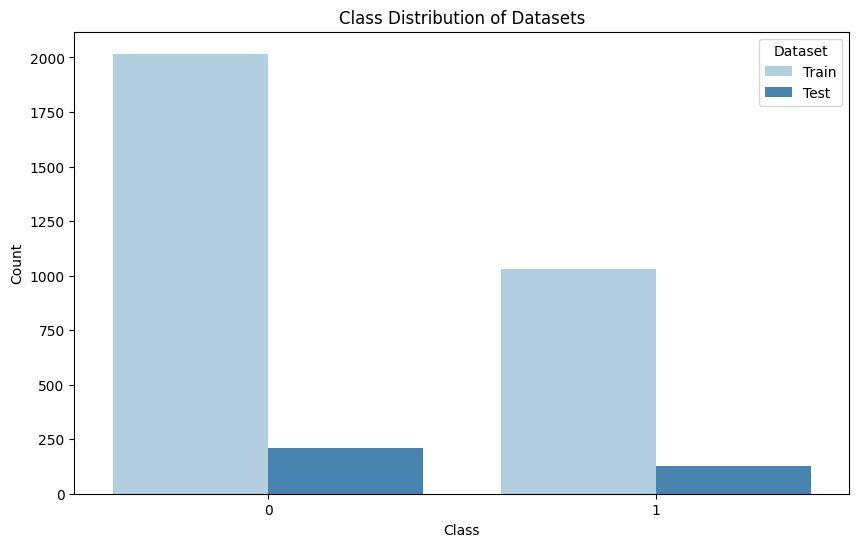

  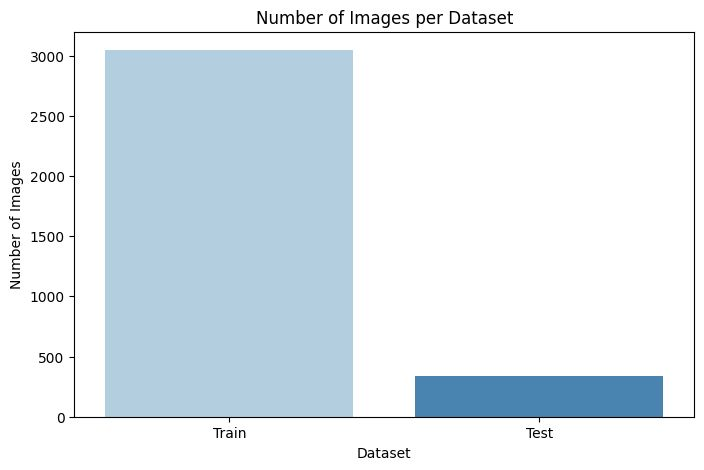

  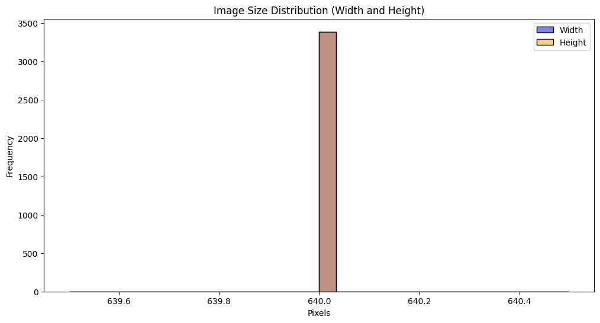

Finally, some samples of the dataset were drawn as shown below:

  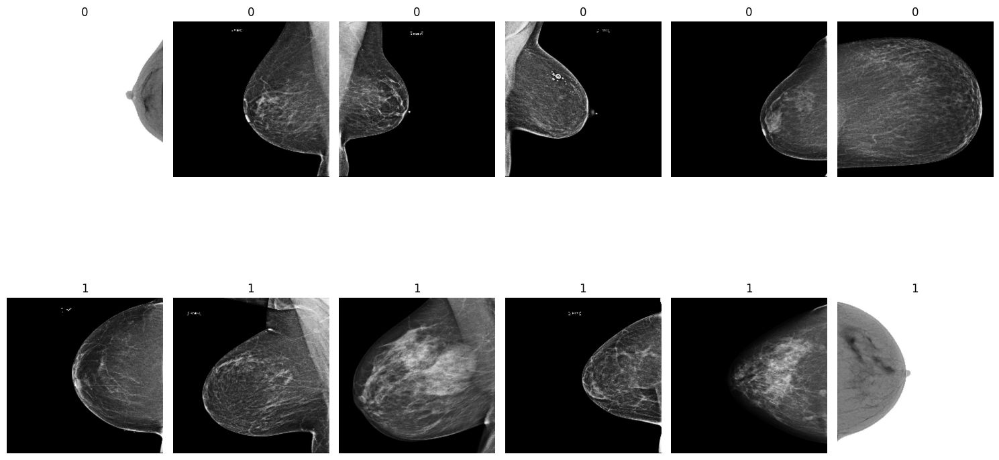

## First trainings
After conducting the exploratory data analysis, 3 pre-trained deep convolutional neural network models were used to train the data for 10 epochs each with the aim of finding the one that will return the best mean test accuracy which will then be used to create the final model.

The results obtained with BATCH_SIZE = 64, DROP_RATE = 0.5, and LEARNING_RATE = 0.0001 are shown below:

The Results for InceptionV3
- Mean Train Accuracy: 0.704
- Mean Test Accuracy: 0.6503
- Mean Train Loss: 0.5663
- Mean Test Loss: 0.7455

The Results for ResNet101V2
- Mean Train Accuracy: 0.703
- Mean Test Accuracy: 0.6509
- Mean Train Loss: 0.5776
- Mean Test Loss: 0.6993

The Results for Xception
- Mean Train Accuracy: 0.7251
- Mean Test Accuracy: 0.6473
- Mean Train Loss: 0.5335
- Mean Test Loss: 0.7709

The plot of the run of each model are shown below:

### InceptionV3

  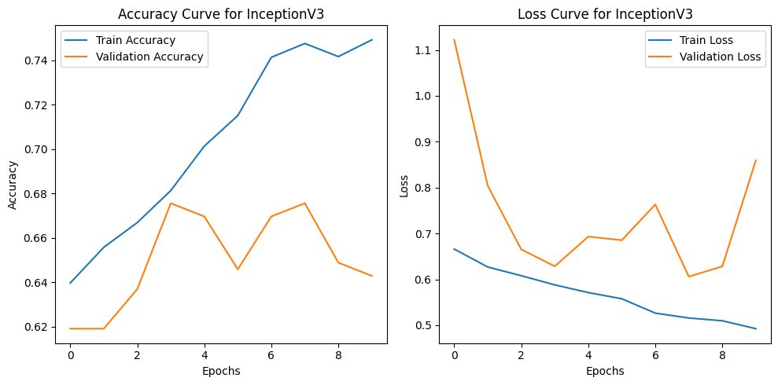

### ResNet101V2

  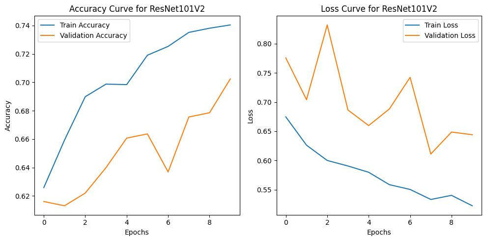

### Xception

  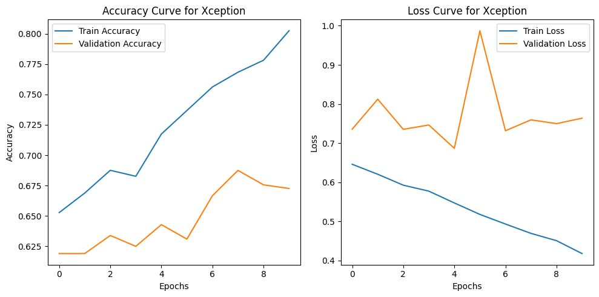

InceptionV3 was selected because its mean test accuracy is just 0.0006 less than ResNet101V2 and its runtime, which is important for sustainability, is half that of ResNet101V2. The diagrams below show the runtime of each model: 

  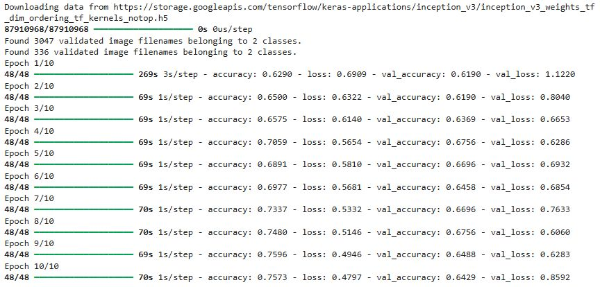

  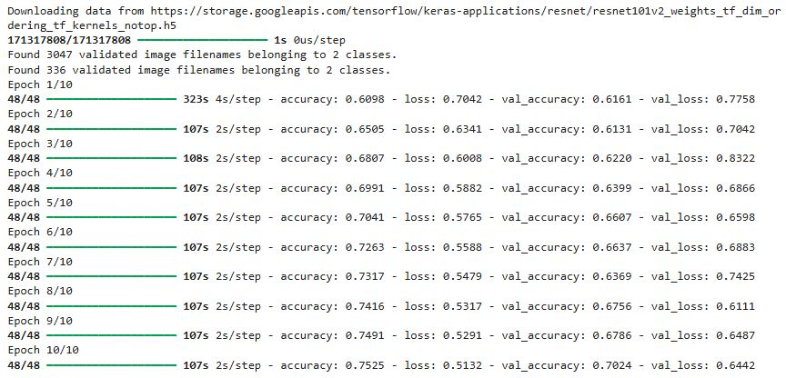

  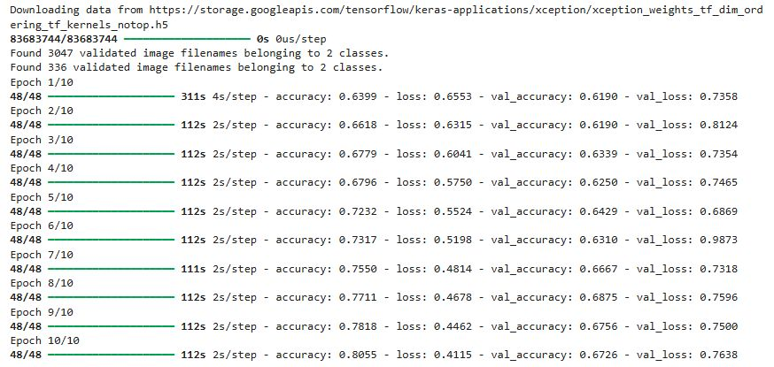

## Second trainings
After selecting the pre-trained model for the project, its parameters were tuned to get better results which are listed below:

InceptionV3 with BATCH_SIZE = 32
- Mean Train Accuracy: 0.706
- Mean Test Accuracy: 0.6542
- Mean Train Loss: 0.5677
- Mean Test Loss: 0.6335

InceptionV3 with DROP_RATE = 0.5
- Mean Train Accuracy: 0.7089
- Mean Test Accuracy: 0.6622
- Mean Train Loss: 0.5609
- Mean Test Loss: 0.6304

InceptionV3 with LEARNING_RATE = 0.00001
- Mean Train Accuracy: 0.701
- Mean Test Accuracy: 0.6506
- Mean Train Loss: 0.5706
- Mean Test Loss: 0.6987

All results were higher than the original and their plots are shown below respectively:

  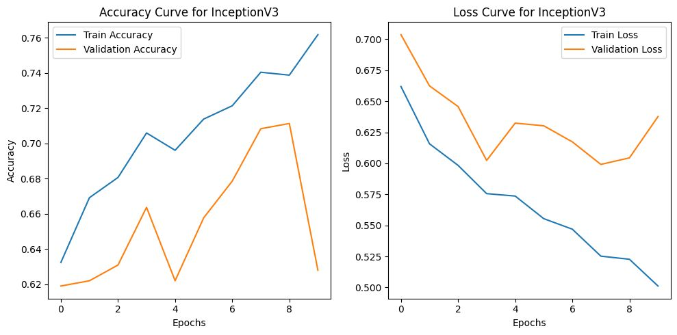

  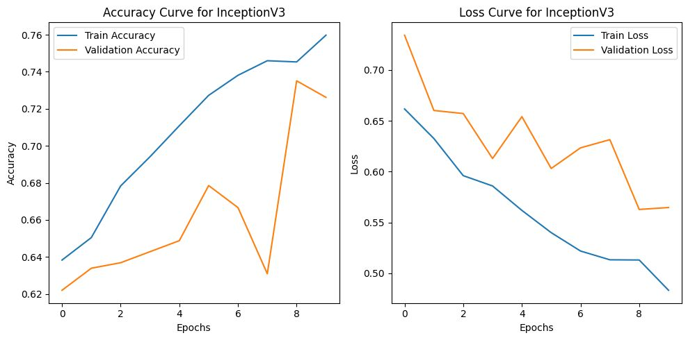

  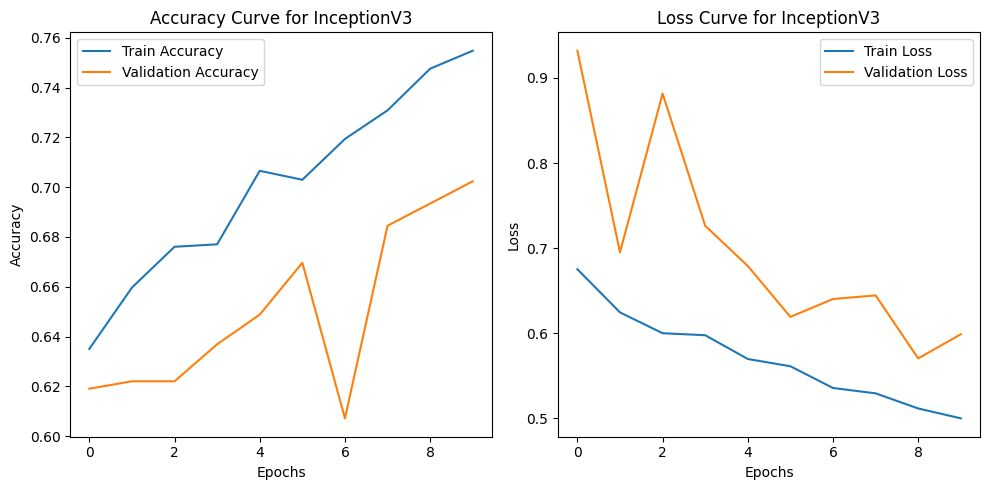

## Final training
The final training was conducted using all the tuning hyper-parameters and the results obtained are listed below:

InceptionV3 with BATCH_SIZE = 32, DROP_RATE = 0.5, LEARNING_RATE = 0.00001
Mean Train Accuracy: 0.715
Mean Test Accuracy: 0.6725
Mean Train Loss: 0.5475
Mean Test Loss: 0.6174

As expected, the result was much higher, and this can be attributed to the reasons below:

Firstly, smaller batch sizes can lead to more frequent updates, which may improve convergence speed thereby providing better accuracy, but can be computationally expensive and time-consuming. It requires less memory and can lead to better generalization due to less noise during the optimization process.

Secondly, dropout prevents the network from becoming too dependent on specific neurons, which improves the model's ability to generalize to new data, it forces the network to learn more generalized representations by preventing it from relying on specific features, it can be seen as training an ensemble of smaller networks, which helps the model learn more robust features.

Finally, the right learning rate will enable the model to converge on something useful while still training in a reasonable amount of time, this can be achieved by cyclical learning rate that involves letting the learning rate oscillate up and down during training, exponential decay that decreases the learning rate at an exponential rate, which can lead to faster convergence, and ReduceLROnPlateau that adjusts the learning rate when a plateau in model performance is detected. The plot of the run is shown below:

  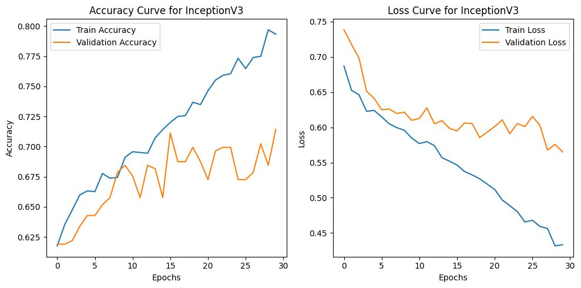

## The model
The resultant model obtained from the final model was saved in keras format so that it can be hosted online for inferencing. The size of the model on disk is 274 MB which makes it impossible to host directly online and the solution to this problem is to enlist the use of tools that will help in solving this problem. Docker and kubernetes are the defacto tools used to solve this problem. 

Docker is a software platform that makes it possible to build, test, and deploy applications quickly. Docker packages software into standardized units called containers that provides all a software needs to run including libraries, system tools, code, and runtime. Using Docker enables quick deployment and scaling of applications into any environment and with a guarantee of the code running.

Kubernetes is an open-source software that allows the deployment and management of containerized applications at scale. Kubernetes manages clusters of cloud compute instances and runs containers on those instances with processes for deployment, maintenance, and scaling. Using Kubernetes, enables running any type of containerized applications using the same toolset on-premises and in the cloud.

The advantages of using docker and kubernetes together are scalability, high availability, portability, security, ease of use, reduced costs, improved agility. The image below shows the aggregated summary of the model.

 

  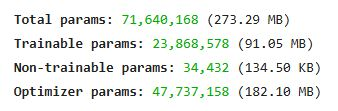

## The project
After saving the model and deciciding on the tools for inferencing, the next task is to built the project by 
starting with the virtual environment followed by the required files in the sequence shown below:

> pipenv --python /home/codespace/miniconda3/bin/python3.9
> pipenv install tensorflow==2.14.0 grpcio==1.64.0 tensorflow-serving-api==2.14.0 
> pipenv install protobuf==4.25.0 numpy==1.23.5 pandas==2.1.4 
> pipenv install pillow flask gunicorn requests keras_image_helper
> pipenv install --dev notebook ipywidgets jupyter matplotlib seaborn tree

Check the tree

 

  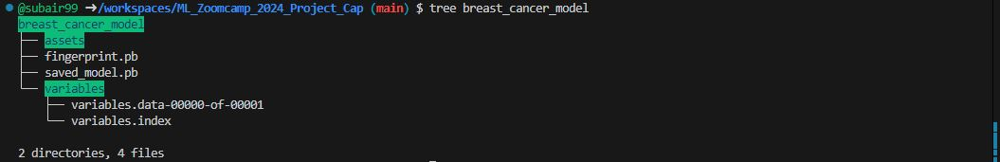

Find the signature defination

  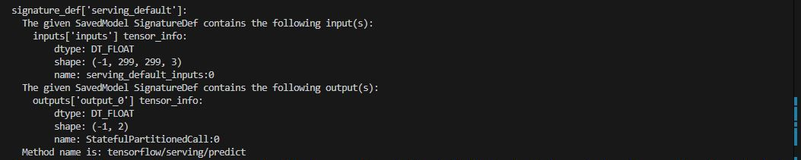

Run the docker locally with the code

  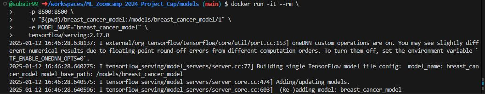

Check kubectl version

  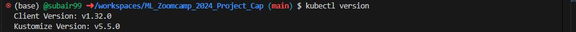

Install kind

  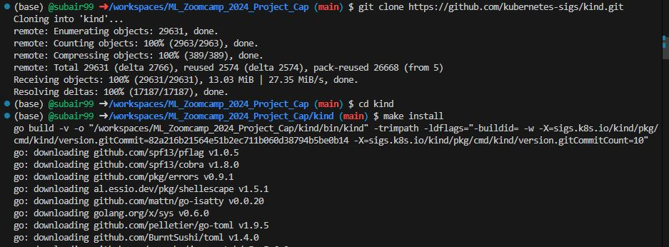

And find the version

  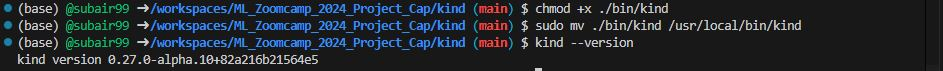

